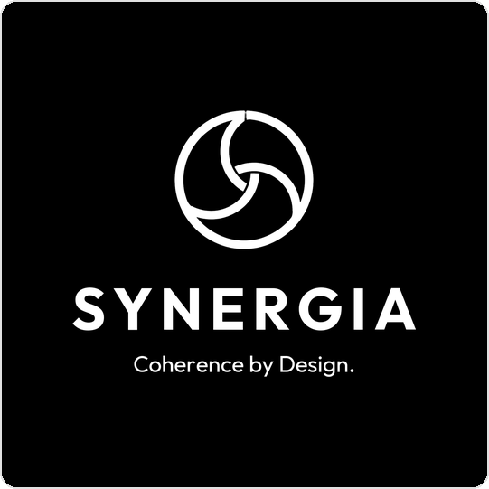

# SYNERGIA — Shared Builder Specification

## Target Directory
`/home/gf307/Documentos/axacademy/prod_final/LR_v0.2/telas_nav/`

## Assets Available
- `assets/icons/*.svg` — 55 SVG icons, 24×24, stroke="#A50034", stroke-width="2", rounded linecaps
- `assets/logos/logo-cores.png` — Color logo (light backgrounds)
- `assets/logos/logo-branco.png` — White monochrome logo (dark backgrounds)
- `assets/logos/logo-negativa.png` — Negative logo (white on red)
- `assets/logos/logo-preto.png` — Black monochrome logo
- `assets/logos/simbolo.png` — Isolated symbol
- `assets/fonts/LGEIHeadlineTTF-{Regular,Semibold,Bold}.ttf`
- `assets/fonts/LGEITextTTF-{Regular,SemiBold,Bold}.ttf`
- `assets/fonts/JetBrainsMono-{Regular,SemiBold,Bold}.ttf`

Key icon filenames: dashboard, analytics, indicator, monitor, report, view, export, history, search, filter, settings, queue, batch, run, refresh, sync, schedule, timer, processing, rules, inventory, production, supplier, capacity, mrp, decision, human-review, assign, state-info, state-success, state-alert, state-attention, state-error, state-unavailable, state-partial, state-neutral, notification, logs, chevron-right, chevron-down, clear, external-link, data-source, source-offline, spreadsheet, mail, integration, consolidate, layers, validation, approve, reject, shield, automation, symbol-synergia

## CSS Custom Properties

### Light Theme (:root)
```
--syn-primary: #A50034
--syn-primary-hover: #8B002C
--syn-primary-light: #FFF0F3
--syn-primary-light-hover: #FFE0E8
--syn-text: #111111
--syn-text-secondary: #686868
--syn-bg: #F3F4F6
--syn-bg-card: #FFFFFF
--syn-bg-sidebar: #FFFFFF
--syn-border: #E5E7EB
--syn-border-focus: #A50034
--syn-success: #3CD5AF
--syn-success-bg: #ECFDF5
--syn-success-text: #065F46
--syn-info: #0096AA
--syn-info-bg: #E0F7FA
--syn-info-text: #006064
--syn-alert: #FFDA27
--syn-alert-bg: #FFFBEB
--syn-alert-text: #78350F
--syn-attention: #E97300
--syn-attention-bg: #FFF7ED
--syn-attention-text: #7C2D12
--syn-error: #C62828
--syn-error-bg: #FEF2F2
--syn-error-text: #991B1B
--syn-unavailable: #8A8A8A
--syn-unavailable-bg: #F5F5F5
--syn-unavailable-text: #525252
--syn-partial: #81758A
--syn-partial-bg: #F5F3FF
--syn-partial-text: #4C1D95
--syn-neutral: #686868
--syn-neutral-bg: #F3F4F6
--syn-neutral-text: #374151
--syn-processing: #0096AA
--syn-processing-bg: #E0F7FA
--syn-stale: #E97300
--syn-radius-sm: 4px
--syn-radius: 8px
--syn-radius-lg: 12px
--syn-shadow: 0 1px 3px rgba(0,0,0,0.08)
--syn-shadow-lg: 0 4px 12px rgba(0,0,0,0.12)
--syn-sidebar-width: 260px
--syn-sidebar-collapsed: 64px
--syn-header-height: 56px
--syn-transition: 200ms ease
--syn-font-heading: 'LGEIHeadline', system-ui, sans-serif
--syn-font-body: 'LGEIText', system-ui, sans-serif
--syn-font-mono: 'JetBrainsMono', 'Consolas', monospace
```

### Dark Theme ([data-theme="dark"])
```
--syn-text: #F3F4F6
--syn-text-secondary: #A1A1AA
--syn-bg: #0F0F0F
--syn-bg-card: #1A1A1A
--syn-bg-sidebar: #141414
--syn-border: #2E2E2E
--syn-primary-light: #2D1520
--syn-primary-light-hover: #3D1F2C
--syn-shadow: 0 1px 3px rgba(0,0,0,0.3)
--syn-shadow-lg: 0 4px 12px rgba(0,0,0,0.4)
--syn-success-bg: #052E16
--syn-success-text: #6EE7B7
--syn-info-bg: #002B33
--syn-info-text: #67E8F9
--syn-alert-bg: #332A00
--syn-alert-text: #FCD34D
--syn-attention-bg: #331700
--syn-attention-text: #FDBA74
--syn-error-bg: #2D0A0A
--syn-error-text: #FCA5A5
--syn-unavailable-bg: #1F1F1F
--syn-unavailable-text: #A1A1AA
--syn-partial-bg: #1F1A2E
--syn-partial-text: #C4B5FD
--syn-neutral-bg: #1F1F1F
--syn-neutral-text: #D1D5DB
```

## Typography Scale
- Page title: font-heading, weight 600, clamp(20px, 2vw, 32px)
- Section title: font-heading, weight 600, clamp(16px, 1.5vw, 24px)
- Subtitle: font-body, weight 400, clamp(13px, 1vw, 16px), color text-secondary
- Body: font-body, weight 400, clamp(13px, 1vw, 16px)
- Button text: font-body, weight 600, 14px
- Table header: font-body, weight 600, clamp(11px, 0.8vw, 13px), uppercase, letter-spacing 0.05em
- Table cell: font-body, weight 400, clamp(12px, 0.9vw, 14px)
- KPI value: font-heading, weight 700, clamp(24px, 2.5vw, 40px)
- KPI label: font-body, weight 600, clamp(11px, 0.8vw, 13px), uppercase
- Mono data: font-mono, for WO IDs, serial numbers, dates, quantities, codes

## Font Face Declarations
```css
@font-face { font-family: 'LGEIHeadline'; src: url('assets/fonts/LGEIHeadlineTTF-Regular.ttf') format('truetype'); font-weight: 400; font-display: swap; }
@font-face { font-family: 'LGEIHeadline'; src: url('assets/fonts/LGEIHeadlineTTF-Semibold.ttf') format('truetype'); font-weight: 600; font-display: swap; }
@font-face { font-family: 'LGEIHeadline'; src: url('assets/fonts/LGEIHeadlineTTF-Bold.ttf') format('truetype'); font-weight: 700; font-display: swap; }
@font-face { font-family: 'LGEIText'; src: url('assets/fonts/LGEITextTTF-Regular.ttf') format('truetype'); font-weight: 400; font-display: swap; }
@font-face { font-family: 'LGEIText'; src: url('assets/fonts/LGEITextTTF-SemiBold.ttf') format('truetype'); font-weight: 600; font-display: swap; }
@font-face { font-family: 'LGEIText'; src: url('assets/fonts/LGEITextTTF-Bold.ttf') format('truetype'); font-weight: 700; font-display: swap; }
@font-face { font-family: 'JetBrainsMono'; src: url('assets/fonts/JetBrainsMono-Regular.ttf') format('truetype'); font-weight: 400; font-display: swap; }
@font-face { font-family: 'JetBrainsMono'; src: url('assets/fonts/JetBrainsMono-SemiBold.ttf') format('truetype'); font-weight: 600; font-display: swap; }
@font-face { font-family: 'JetBrainsMono'; src: url('assets/fonts/JetBrainsMono-Bold.ttf') format('truetype'); font-weight: 700; font-display: swap; }
```

## HTML Page Template
```html
<!DOCTYPE html>
<html lang="pt-BR" data-theme="light" data-tv="false">
<head>
    <meta charset="UTF-8">
    <meta name="viewport" content="width=device-width, initial-scale=1.0">
    <meta name="description" content="SYNERGIA — [page description]">
    <title>SYNERGIA — [Page Title]</title>
    <link rel="stylesheet" href="styles.css">
</head>
<body>
    <a href="#main-content" class="skip-link">Pular para o conteúdo principal</a>
    <div class="app" id="app">
        <aside class="sidebar" id="sidebar" aria-label="Menu principal"></aside>
        <div class="main-wrapper">
            <header class="header" id="header" aria-label="Cabeçalho"></header>
            <div class="tv-header" id="tv-header" aria-hidden="true">
                
                <span class="tv-title">[Page Title]</span>
                <div class="tv-header-right">
                    <span class="tv-update">Atualizado: <time id="tv-last-update"></time></span>
                    <span class="tv-clock" id="tv-clock"></span>
                    <button class="tv-exit-btn" onclick="setTVMode(false)" aria-label="Sair do Modo TV">✕ Sair</button>
                </div>
            </div>
            <main id="main-content" class="content" role="main">
                <!-- Normal content (hidden in TV mode) -->
                <div class="content-normal" data-tv-hide>
                    <!-- PAGE CONTENT -->
                </div>
                <!-- TV Panels (shown only in TV mode) -->
                <div class="tv-panels" id="tv-panels" data-tv-show>
                    <section class="tv-panel active" data-tv-panel="0">...</section>
                    <section class="tv-panel" data-tv-panel="1">...</section>
                </div>
            </main>
        </div>
    </div>
    <div class="demo-banner" role="status">Demonstração — dados sintéticos</div>
    <div class="modal-overlay" id="modal-confirm" role="dialog" aria-modal="true" aria-hidden="true">
        <div class="modal">
            <div class="modal-header"><h2 class="modal-title" id="modal-confirm-title"></h2><button class="modal-close" onclick="hideModal('modal-confirm')" aria-label="Fechar">✕</button></div>
            <div class="modal-body" id="modal-confirm-body"></div>
            <div class="modal-footer"><button class="btn btn-secondary" onclick="hideModal('modal-confirm')">Cancelar</button><button class="btn btn-primary" id="modal-confirm-action">Confirmar</button></div>
        </div>
    </div>
    <div class="toast-container" id="toast-container" aria-live="polite"></div>
    <script src="data.js"></script>
    <script src="script.js"></script>
    <script>
        document.addEventListener('DOMContentLoaded', () => {
            initApp('[pageName]');
            // Page-specific logic
        });
    </script>
</body>
</html>
```

## Navigation Items (for renderSidebar in script.js)
```javascript
const NAV_ITEMS = [
    { group: 'VISÃO GERAL', items: [
        { id: 'dashboard', label: 'Dashboard', icon: 'dashboard', href: 'index.html' }
    ]},
    { group: 'OPERAÇÃO', items: [
        { id: 'consulta', label: 'Consulta por lote/WO', icon: 'batch', href: 'consulta.html' },
        { id: 'monitor', label: 'Monitor de execuções', icon: 'monitor', href: 'monitor.html' },
        { id: 'pendencias', label: 'Fila de pendências', icon: 'queue', href: 'pendencias.html' }
    ]},
    { group: 'RESULTADOS', items: [
        { id: 'relatorios', label: 'Relatórios', icon: 'report', href: 'relatorios.html' }
    ]},
    { group: 'SISTEMA', items: [
        { id: 'configuracoes', label: 'Configurações', icon: 'settings', href: 'configuracoes.html' }
    ]}
];
```

## CSS Class Reference

### Layout
- `.app` — Root grid: sidebar + main-wrapper
- `.sidebar` — Fixed left nav, 260px width
- `.sidebar-collapsed` — 64px, icons only
- `.sidebar-logo` — Logo container
- `.sidebar-nav` — Navigation list
- `.sidebar-group` — Group container
- `.sidebar-group-label` — "VISÃO GERAL" etc, uppercase, small
- `.sidebar-item` — Nav link
- `.sidebar-item.active` — Current page, red bg
- `.sidebar-overlay` — Mobile overlay
- `.main-wrapper` — Right section
- `.header` — Top bar, 56px height
- `.header-search` — Search input container
- `.header-actions` — Right side buttons
- `.content` — Main scrollable area (padding)
- `.content-grid` — 2-column grid layout inside content
- `.content-grid-wide` — Left column (wider)
- `.content-grid-narrow` — Right column (narrower)

### Page Header
- `.page-header` — Flex between title and actions
- `.page-title` — H1
- `.page-subtitle` — Description
- `.page-actions` — Button group

### Cards
- `.card` — White box with border-radius, shadow, border
- `.card-header` — Flex header with title and optional badge/action
- `.card-title` — H2/H3 inside card
- `.card-body` — Padded content
- `.card-footer` — Bottom actions

### KPI Cards
- `.kpi-grid` — CSS grid, 4 columns (responsive)
- `.kpi-card` — Individual KPI card
- `.kpi-icon` — Icon container with color background
- `.kpi-icon-primary`, `.kpi-icon-alert`, `.kpi-icon-error`, `.kpi-icon-info`
- `.kpi-value` — Large number
- `.kpi-label` — Uppercase label
- `.kpi-sublabel` — Secondary detail text

### Badges
- `.badge` — Base badge (inline-flex, padding, rounded)
- `.badge-success`, `.badge-error`, `.badge-alert`, `.badge-attention`
- `.badge-info`, `.badge-unavailable`, `.badge-partial`, `.badge-neutral`
- `.badge-processing`, `.badge-stale`
Each badge has: background color, text color, small icon before text

### Data Tables
- `.table-container` — Wrapper
- `.data-table` — Full-width table
- `.data-table th` — Header cells
- `.data-table td` — Data cells
- `.data-table tbody tr:hover` — Row highlight
- `.table-row-selected` — Selected row (primary-light bg)
- `.table-footer` — Pagination bar
- `.table-info` — "1–5 de 24"
- `.pagination` — Button group
- `.table-actions` — Cell with action links
- `.mono` — Class for monospace text in cells

### Filter Bar
- `.filter-bar` — Flex wrapper
- `.filter-group` — Label + control pair
- `.filter-label` — Label element
- `.form-select` — Dropdown
- `.form-input` — Text input
- `.filter-actions` — Apply/Clear buttons

### Buttons
- `.btn` — Base button
- `.btn-primary` — Red background, white text
- `.btn-secondary` — White/card bg, border, dark text
- `.btn-ghost` — No bg, red text, underline hover
- `.btn-sm` — Small variant
- `.btn-icon` — Icon-only button (44x44 minimum)

### Alerts
- `.alert` — Alert bar
- `.alert-warning` — Yellow border-left, alert-bg
- `.alert-error` — Red border-left
- `.alert-info` — Blue border-left
- `.alert-partial` — Purple border-left
- `.alert-icon`, `.alert-content`, `.alert-data`
- `.alert-data-item`, `.alert-data-label`, `.alert-data-value`

### Source List
- `.source-list` — Container
- `.source-item` — Flex row
- `.source-dot` — Colored circle
- `.source-dot-success`, `.source-dot-error`, `.source-dot-partial`, `.source-dot-unavailable`
- `.source-name`, `.source-badge`, `.source-time`, `.source-link`

### Timeline
- `.timeline` — Vertical list
- `.timeline-item` — Flex row
- `.timeline-dot` — Colored circle with line
- `.timeline-dot-info`, `.timeline-dot-success`, `.timeline-dot-alert`
- `.timeline-content` — Text container
- `.timeline-time`, `.timeline-text`

### Modal
- `.modal-overlay` — Full screen backdrop, hidden by default
- `.modal-overlay.active` — Visible
- `.modal` — Centered white card
- `.modal-header`, `.modal-title`, `.modal-close`
- `.modal-body`, `.modal-footer`

### Status Bar
- `.status-bar` — Horizontal row of status items
- `.status-item` — Label + value pair

### Process Steps (Consulta page)
- `.process-steps` — Horizontal stepper
- `.step` — Individual step
- `.step-icon`, `.step-label`, `.step-status`
- `.step-success`, `.step-alert`, `.step-info`, `.step-pending`
- `.step-connector` — Line between steps

### TV Mode
- `[data-tv="true"]` — Parent selector
- `.tv-header` — Red bar shown only in TV mode
- `.tv-logo` — Small white logo
- `.tv-title` — Page title in TV bar
- `.tv-clock` — Live clock
- `.tv-update` — Last update time
- `.tv-exit-btn` — Exit button
- `.tv-panels` — Container for auto-cycling panels
- `.tv-panel` — Individual panel (100% height)
- `.tv-panel.active` — Currently visible panel
- `[data-tv-hide]` — Elements hidden in TV mode
- `[data-tv-show]` — Elements shown only in TV mode

### Utilities
- `.mono` — Monospace font
- `.text-primary` — Primary red color text
- `.text-success`, `.text-error`, `.text-alert` etc
- `.visually-hidden` — Screen reader only
- `.skip-link` — Skip to main content
- `.demo-banner` — Fixed bottom bar

## data.js Schema

```javascript
window.SYNERGIA_DATA = {
    meta: {
        lastUpdate: '2026-07-31T06:18:00',      // ISO datetime
        lastExecution: {
            id: 'EX-20260731-006',
            status: 'partial',                    // success|partial|error|processing
            statusLabel: 'Concluída com pendências'
        },
        duration: '08 min 42 s',
        nextExecution: '2026-08-01T06:00:00',
        environment: 'Demonstração'
    },

    sources: [
        // 6 entries: GRP, NFP, PPH, SM, OWM, GSP
        // Each: { id, name, status: 'available'|'partial'|'unavailable'|'error', items: number, lastUpdate: ISO, detail: string }
    ],

    workorders: [
        // ~15 entries. Each has:
        // { id, lot, model, suffix, plant, line, lotQty, produced, received, released,
        //   pendingProduction, oqcPass, oqcPending, snOnHand, hold, holdReason,
        //   oqcHold, longTermHold, rework, shipBlock, location, inventoryState,
        //   container, source, evidenceDate, priority, otd1, status }
        // status values: 'concluida', 'em_analise', 'pendente', 'divergencia', 'bloqueada'
        // priority: 'critica', 'alta', 'media', 'baixa'
        // Include examples of each status and some with holdReason = null (incomplete data)
    ],

    serials: [
        // ~30 entries linked to WOs. Each has:
        // { serialNumber, workorder, lot, model, location, inventoryState,
        //   oqcApproval, holdReason, oqcHold, longTermHold, rework, shipBlock,
        //   container, source, date }
    ],

    executions: [
        // ~10 entries. Each has:
        // { id (format EX-YYYYMMDD-NNN), start, end, duration, type: 'automatica'|'manual',
        //   result: 'concluida'|'parcial'|'falha'|'processando',
        //   attempt, totalAttempts, read, processed, rejected,
        //   sources: [{ name, status, items, detail }],
        //   params: string }
        // Include one that is 'processando', one 'falha', several 'concluida', one 'parcial'
    ],

    pendencies: [
        // ~12 entries. Each has:
        // { id (format P-NNNN), workorder, lot, model, reason, source, affectedQty,
        //   aging: string, impact: 'critico'|'alto'|'medio'|'baixo',
        //   priority: 'critica'|'alta'|'media'|'baixa', otd1: number|null,
        //   responsible: 'Suprimentos'|'Produção'|'Logística'|'Qualidade',
        //   container, status: 'nova'|'aberta'|'em_analise'|'resolvida'|'escalada',
        //   datetime, partialData: boolean,
        //   description: string,
        //   history: [{ date, text, icon }],
        //   relatedExecution, estimatedRelease: string|null,
        //   sortingStatus: string|null, evidence: string|null, actions: string[] }
    ],

    reports: [
        // ~6 entries. Each has:
        // { id (format REL-YYYYMMDD-NN), title, type: 'consolidado'|'oqc_summary'|'pendencias',
        //   datetime, execution, period, dataStatus: 'completo'|'parcial',
        //   status: 'gerado'|'pendente'|'erro', needsReview: boolean }
    ],

    containers: [
        // ~5 entries. Each has:
        // { id, workorder, serials: string[], status: 'liberado'|'bloqueado'|'parcial', carrier }
    ],

    alerts: [
        // ~4 entries. Each has:
        // { type: 'unavailable'|'divergence'|'stale'|'overdue',
        //   severity: 'error'|'attention'|'alert'|'info',
        //   message, link: 'page.html', linkText }
    ]
};
```

## script.js Functions

```javascript
// === Initialization ===
function initApp(currentPage) // Sets up sidebar, header, theme, TV mode, clock
function initTheme()          // Detect preferred + localStorage, apply

// === Theme ===
function setTheme(theme)      // 'light'|'dark', updates data-theme, localStorage, logo
function toggleTheme()        // Switches between light/dark

// === TV Mode ===
function setTVMode(enabled)   // Toggles data-tv attribute, hides/shows elements
function startTVCarousel(containerId, intervalMs) // Auto-cycle .tv-panel children
function stopTVCarousel()     // Clear interval
// TV carousel pauses on user interaction (click, keypress, mousemove) and resumes after 30s

// === Sidebar & Header ===
function renderSidebar(currentPage) // Builds nav HTML from NAV_ITEMS, marks active
function renderHeader()             // Builds header with search, theme toggle, TV btn, user
function toggleSidebar()            // Mobile sidebar toggle
function closeSidebar()             // Close mobile sidebar

// === Icons ===
// Icons loaded inline from fetch('assets/icons/NAME.svg'), cached in Map
async function loadIcons()     // Preload all icons
function getIcon(name, cls)    // Returns SVG string, optional extra class
function getIconEl(name)       // Returns DOM element

// === Modal ===
function showModal(modalId)    // Display modal, trap focus
function hideModal(modalId)    // Hide modal, release focus
function confirmAction(title, message, onConfirm) // Show confirm modal

// === Tables ===
function renderPagination(containerId, total, current, pageSize, onChange) // Pagination UI

// === Formatting ===
function formatDateTime(iso)   // "DD/MM/YYYY às HH:MM"
function formatDate(iso)       // "DD/MM/YYYY"
function formatTime(iso)       // "HH:MM"
function formatDuration(secs)  // "Xm Ys"

// === Toast ===
function showToast(message, type, durationMs) // Temporary notification

// === Clock ===
function startClock(elementId) // Updates element with current time every second

// === Focus Management ===
function trapFocus(element)
function releaseFocus()

// === Badges ===
function getBadgeHTML(status, label) // Returns badge HTML with correct class and icon
function getImpactBadge(impact)     // Impact-specific badge
function getStatusBadge(status)     // Status-specific badge

// === Loading States ===
function showLoading(containerId)
function hideLoading(containerId)
function showEmpty(containerId, message)
function showError(containerId, message)
```

## Accessibility Requirements
- Skip link as first element
- Semantic HTML: nav, main, section, table, button, h1-h3
- aria-current="page" on active nav item
- aria-label on icon-only buttons
- aria-hidden="true" on decorative icons
- Visible focus outline: 2px solid var(--syn-primary), offset 2px
- Tab order follows visual order
- Color + icon + text for all states
- prefers-reduced-motion: disable animations, transitions, auto-carousel
- Touch targets minimum 44×44px
- Contrast ratio minimum 4.5:1 for text, 3:1 for UI elements

## TV Mode Behavior
- All scrolling disabled (overflow: hidden on body, content)
- Sidebar hidden
- Normal header hidden, TV header shown (red background bar)
- Content uses 100dvh - tv-header-height
- Auto-carousel cycles panels every 15s (configurable)
- Pause carousel on any interaction, resume after 30s
- [data-tv-hide] elements hidden
- [data-tv-show] elements shown
- Font sizes scale up (larger clamp values)
- Tables show max 5-6 rows per panel

## Responsive Breakpoints
- `>= 1920px`: Full layout
- `1366–1919px`: Sidebar slightly narrower
- `1024–1365px`: Sidebar collapsed (icons only), 2-col grid
- `768–1023px`: Sidebar hidden, hamburger menu, 1-2 col grid
- `< 768px`: Mobile nav bottom bar, single column, tables → cards
