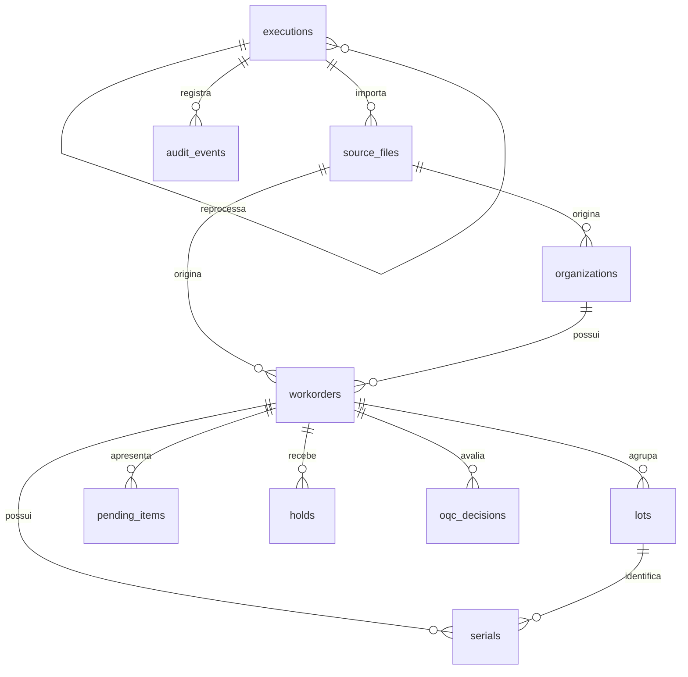

# Modelo persistente

O PostgreSQL é a fonte persistente do sistema. A planilha `WO Status.xlsx` é
somente uma fonte de importação e homologação; cada registro operacional aponta
para a execução e o arquivo que o originaram.

## Migrations

Os arquivos de `database/migrations/` são executados em ordem lexicográfica.
Partindo de um banco vazio:

```bash
export PGHOST=localhost PGPORT=5432 PGDATABASE=synergia
export PGUSER=synergia PGPASSWORD=synergia-local-only
python scripts/validate_project_assets.py
```

## Entidades e decisões

- `executions` registra tentativa, estado e vínculo de reprocessamento;
- `source_files` mantém metadados e SHA-256, com proteção contra duplicidade;
- `workorders`, `lots` e `serials` preservam identificadores como texto;
- `container_number` também é texto para preservar zeros à esquerda;
- todas as entidades operacionais apontam para `execution_id` e
  `source_file_id`;
- `pending_items` representa impedimentos anteriores à liberação;
- `holds` representa retenções pós-liberação e aceita razão ausente;
- `oqc_decisions` registra o estado da decisão sem automatizá-la;
- `audit_events` registra eventos e contexto adicional em `jsonb`;
- quantidades são não negativas e a liberação parcial exige quantidade
  liberada maior que zero e menor que a recebida.

O arquivo original aceito é preservado em diretório controlado. O banco mantém
nome, extensão, tipo, tamanho, SHA-256 e somente a chave relativa de
armazenamento. A execução registra fonte, ator, início, fim, estado, motivo de
falha e eventual execução original em caso de duplicidade.

## Diagrama entidade-relacionamento



## Teste de persistência

O teste de integração aplica todas as migrations em PostgreSQL 16 e persiste
uma execução reprocessada, fonte, Workorder, lote, serial, container, pendência
e hold. O cenário também comprova liberação parcial e preservação de zeros à
esquerda. A massa de referência está em
`data/synthetic/database_example.json`.
