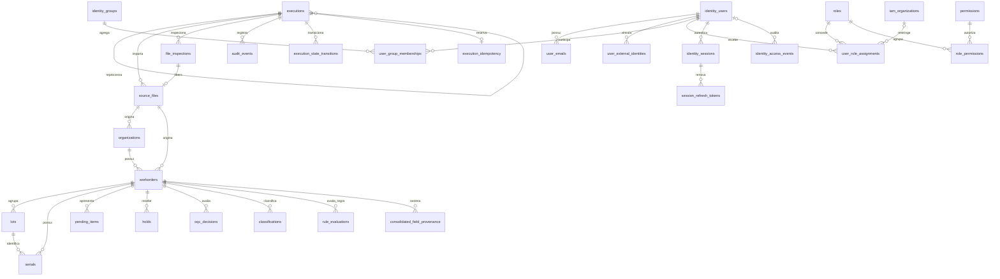

# Modelo persistente

O PostgreSQL é a fonte persistente do sistema. A planilha `WO Status.xlsx` é
somente uma fonte de importação e homologação; cada registro operacional aponta
para a execução e o arquivo que o originaram.

## Migrations

Os arquivos de `database/migrations/` são executados em ordem lexicográfica.
Partindo de um banco vazio:

```bash
export PGHOST=localhost PGPORT=5432 PGDATABASE=synergia
export PGUSER=synergia PGPASSWORD=synergia-local-only
python scripts/validate_project_assets.py
```

## Entidades e decisões

- `executions` registra tentativa, estado e vínculo de reprocessamento;
- `source_files` mantém metadados e SHA-256, com proteção contra duplicidade;
- `file_inspections` registra tipo declarado/detectado, hash, tamanho, decisão,
  motivo e retenção sem expor caminhos internos;
- `workorders`, `lots` e `serials` preservam identificadores como texto;
- `container_number` também é texto para preservar zeros à esquerda;
- todas as entidades operacionais apontam para `execution_id` e
  `source_file_id`;
- `pending_items` representa impedimentos anteriores à liberação;
- `holds` representa retenções pós-liberação e aceita razão ausente;
- `oqc_decisions` registra o estado da decisão sem automatizá-la;
- `classifications` preserva regra, versão, prioridade, justificativa e evidência;
- `rule_evaluations` registra também as regras que não foram acionadas;
- `consolidated_field_provenance` liga cada campo consolidado às linhas de origem;
- `audit_events` registra eventos e contexto adicional em `jsonb`;
- `execution_state_transitions` preserva estado anterior, novo estado,
  responsável, motivo, data e versão otimista;
- `execution_idempotency` reserva importações e reprocessamentos pelo
  fingerprint dos arquivos, execução e versões do pipeline e das regras;
- `identity_users`, `user_emails` e `user_external_identities` mantêm a
  identidade interna sem depender de e-mail ou provedor;
- `identity_groups`, `roles`, `permissions` e suas associações modelam
  autorização por ação;
- `iam_organizations` oferece UUID estável para escopo de papel, separado das
  organizações observadas nas importações;
- `identity_sessions` e `session_refresh_tokens` mantêm revogação, expiração e
  somente o hash do refresh token;
- `identity_users.version` protege atualizações administrativas com concorrência
  otimista;
- `identity_access_events` preserva um histórico append-only sem exclusão em
  cascata;
- quantidades continuam `NULL` quando ausentes na origem; quando informadas, são
  não negativas e a liberação parcial exige quantidade liberada maior que zero
  e menor que a recebida.

Cada Workorder consolidada é uma unidade transacional independente. Uma falha
reverte lote, serial, classificação, pendência e proveniência daquela unidade,
registra `processing_persistence_failed` e não impede a confirmação das demais
Workorders da execução. Chaves estrangeiras compostas com `execution_id`
impedem relacionamentos entre execuções diferentes.

O arquivo fica em quarentena até a aprovação. O original aceito é preservado em
diretório controlado com nome interno aleatório. O banco mantém nome original
como metadado, extensão, tipos declarado e detectado, tamanho, SHA-256, decisão
e somente a chave relativa de armazenamento do aceito. A execução registra
fonte, ator, início, fim, estado, motivo de falha e eventual execução original
em caso de duplicidade.

## Diagrama entidade-relacionamento



Entidades, invariantes, índices e rollback do núcleo IAM são detalhados em
[identity-data-model.md](../docs/identity-data-model.md).

A migration `0015_create_access_control_contracts.sql` publica o catálogo
`1.0.0`, adiciona concorrência otimista a grupos e papéis e preserva o histórico
de concessões diretas, por papel e por grupo. Os contratos administrativos e a
regra de proteção do último administrador estão em
[access-control-administration.md](../docs/access-control-administration.md).

## Teste de persistência

Os testes de integração aplicam todas as migrations em PostgreSQL 16 e cobrem
persistência completa, continuidade parcial, rollback da unidade afetada,
integridade entre execuções, reinício do repositório e presença dos índices das
consultas críticas. A massa de referência está em
`data/synthetic/database_example.json`.
