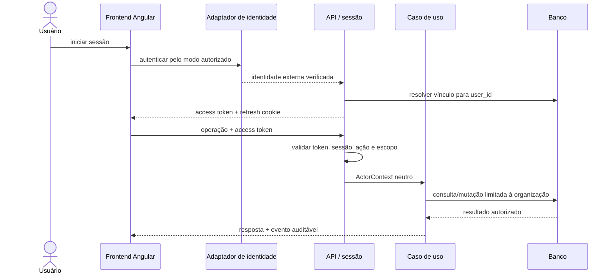

# ADR 0001: estratégia de identidade e sessão

- **Estado:** aceita para a Etapa 2
- **Data:** 31/08/2026
- **Decisores:** equipe SYNERGIA
- **Revisão independente:** pendente no pull request
- **Referências:** RF013, RF028, RF043, RNF005, RNF006 e RNF015 do
  Levantamento de Requisitos v1.0

## Contexto

O SYNERGIA precisa identificar quem consulta dados, envia arquivos, solicita
reprocessamentos, exporta evidências ou administra acessos. O levantamento exige
menor privilégio, auditoria do usuário que dispara ou reprocessa uma execução,
proteção de dados pessoais e uso dos mecanismos corporativos. Ele não informa,
porém, qual provedor corporativo, protocolo, conjunto de claims, política de MFA
ou processo de provisionamento estará disponível.

Acoplar `user_id` a e-mail, login ou `sub` de um provedor tornaria trocas de
provedor e correções de cadastro inseguras. Implementar um diretório local para
produção também criaria uma política de identidade paralela sem autorização.

## Alternativas consideradas

| Alternativa | Benefícios | Riscos e limites | Resultado |
| --- | --- | --- | --- |
| Identidade local | Independência da TI; simples em desenvolvimento | Duplica senha, MFA, desligamento e recuperação; contraria a diretriz corporativa sem autorização | Rejeitada para produção; permitida somente como adaptador de desenvolvimento/teste |
| Identidade corporativa direta | Ciclo de vida e MFA centralizados | Provedor e contratos ainda desconhecidos; acopla domínio a claims externos | Alvo de produção, mas integração bloqueada até homologação da TI |
| Híbrida com núcleo neutro | Permite identidade corporativa e, se autorizada, local; mantém domínio estável | Exige mapeamento e sessão próprios, além de governança de vínculos | Adotada |

## Decisão

Será adotada uma arquitetura híbrida, com **identidade corporativa como modo de
produção preferencial** e um núcleo interno independente do provedor. Login
local de produção permanece desabilitado até decisão explícita da TI e do
gestor. Esta ADR não autoriza integração, acesso a diretório corporativo nem
armazenamento de credenciais reais.

O primeiro incremento de implementação poderá criar apenas os contratos e o
modelo neutro abaixo, usando identidades sintéticas em testes. A ativação de um
adaptador corporativo ou local é um portão de implantação separado.

### Fronteiras e identificadores

- `user_id`: UUID gerado pelo SYNERGIA, imutável e nunca reutilizado. Não será
  e-mail, matrícula, login nem identificador do provedor.
- `identity_link_id`: UUID interno de um vínculo; `(provider_key, subject)` é
  único. `subject` é dado do adaptador e pode mudar por revinculação auditada,
  sem mudar `user_id`.
- `organization_id`: UUID interno estável. Códigos das fontes são aliases, não
  chaves primárias.
- `session_id`: UUID aleatório por autenticação, presente como `sid` no access
  token e no registro de sessão. Reautenticação cria outra sessão.
- `token_id` (`jti`): UUID único por access token. Refresh tokens são segredos
  opacos aleatórios, armazenados somente por hash e rotacionados a cada uso.

O domínio recebe um `ActorContext(user_id, session_id, organization_scope,
permissions)` produzido pela camada de aplicação. Casos de uso dependem desse
contexto e de uma porta `IdentityProvider`; não recebem claims, SDKs, e-mail ou
objetos do IdP. Adaptadores traduzirão uma identidade corporativa, ou uma
identidade local autorizada, para `user_id` por meio do vínculo interno.

### Sessão e tokens

Após autenticação pelo adaptador, o backend emitirá sua própria sessão de
aplicação. Esta política é a base para implementação posterior:

| Controle | Decisão inicial |
| --- | --- |
| Access token | JWT assinado, audiência e emissor verificados, duração de 15 minutos |
| Refresh token | opaco, uso único, duração ociosa de 8 horas e absoluta de 24 horas |
| Rotação | obrigatória; reutilização revoga toda a família e gera evento de segurança |
| Sessões simultâneas | até 3 por usuário; a quarta revoga a menos recente |
| Encerramento | logout revoga a sessão; troca de senha, desativação ou incidente pode revogar todas |
| Validação | access token expirado é recusado; recursos sensíveis consultam sessão não revogada |
| Armazenamento no navegador | refresh token em cookie `HttpOnly`, `Secure` e `SameSite`; access token somente em memória |
| Auditoria | criação, renovação, revogação, falha e reutilização registram IDs internos, sem gravar tokens |

Revogação global por usuário e revogação por `session_id` devem produzir efeito
imediato na renovação e, no máximo, em 15 minutos para um access token já
emitido. Administração de acessos e exportação de evidência são operações
sensíveis e devem verificar a sessão no servidor, reduzindo essa janela.

### Senha e recuperação

Não haverá senha local em produção enquanto o portão correspondente estiver
fechado. Se login local for posteriormente autorizado, a implementação exigirá
nova aprovação de segurança e, no mínimo:

- 12 caracteres, aceitando frases e todos os caracteres, sem regras artificiais
  de composição;
- bloqueio de senhas comuns ou comprometidas e hash com Argon2id em parâmetros
  homologados;
- limite progressivo de tentativas, sem revelar se a conta existe;
- recuperação por token aleatório de uso único, armazenado por hash, válido por
  15 minutos; sua utilização revoga todas as sessões;
- nenhuma pergunta de segurança, senha enviada por e-mail ou troca periódica
  sem indício de comprometimento;
- MFA conforme política corporativa ou decisão específica da TI.

## Fluxo de autenticação e autorização

Autenticação confirma uma identidade; autorização verifica uma ação e seu
escopo. Menus podem refletir permissões, mas nunca substituem a verificação no
backend.

## Consequências

### Positivas

- troca de IdP não altera chaves de domínio, autoria ou trilhas de auditoria;
- papéis agrupam permissões, enquanto cada endpoint autoriza uma ação;
- sessões podem ser revogadas independentemente do provedor;
- escopo organizacional é aplicado no servidor e não confiado a filtros do
  cliente.

### Custos e riscos

- será necessário manter vínculos, sessões e revogações internas;
- indisponibilidade do IdP impede novas autenticações, embora sessões válidas
  possam continuar conforme a política;
- vinculação incorreta entre identidade externa e usuário interno é uma ação
  administrativa sensível e auditável;
- parâmetros de cookie, chaves e algoritmos ainda deverão passar pela revisão
  de segurança do ambiente de implantação.

## Portões e decisões pendentes

| ID | Decisão/insumo | Responsável | Bloqueia |
| --- | --- | --- | --- |
| ID-P01 | IdP, protocolo (OIDC/SAML), issuer, audience e claims homologados | TI/Segurança | adaptador corporativo |
| ID-P02 | MFA, Conditional Access, VPN/rede e tempo máximo corporativo de sessão | TI/Segurança | homologação da política de sessão |
| ID-P03 | origem dos grupos, provisionamento/desprovisionamento e SLA de desligamento | TI/Gestor | administração de acessos |
| ID-P04 | autorização ou proibição definitiva de login local em produção | TI/Segurança | adaptador local e recuperação |
| ID-P05 | custódia e rotação de chaves, cofre e domínio dos cookies | TI/DevOps | emissão de tokens |
| ID-P06 | organizações existentes e responsáveis por conceder escopo | Gestor | carga de escopos de produção |
| ID-P07 | retenção de sessões, eventos de segurança e identificadores pessoais | DPO/TI/Gestor | política de retenção |
