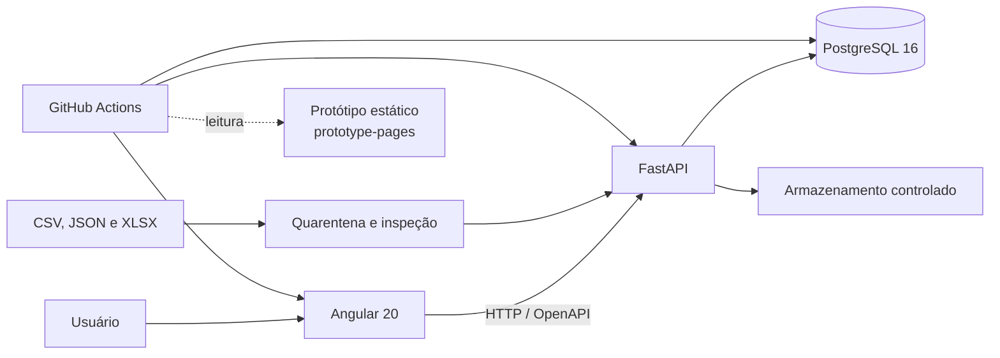

# Arquitetura vigente

Este documento registra a arquitetura implementada ao término da Etapa 4. Ele
separa explicitamente o que existe na `main` do que permanece planejado.

## Visão geral

O Angular é a tecnologia oficial do frontend da aplicação. A API FastAPI é a
única fronteira de acesso prevista para telas: o frontend não acessa o banco
nem manipula arquivos importados diretamente. PostgreSQL mantém o estado
operacional e o armazenamento controlado preserva os arquivos e relatórios de
uma execução.

## Componentes implementados

| Camada | Responsabilidade | Referência principal |
| --- | --- | --- |
| Angular 20 | aplicação web e consumo da API | `web/` |
| FastAPI | importação, consultas, validação HTTP e OpenAPI | `backend/app/` |
| Serviços de domínio | estados, normalização, consolidação e regras determinísticas | `backend/app/execution.py`, `normalization.py`, `consolidation.py` e `business_rules.py` |
| PostgreSQL 16 | execuções, fontes, resultados, pendências e auditoria | `database/migrations/` |
| Armazenamento controlado | quarentena isolada, original aceito com nome aleatório, relatório e resultado normalizado | `IMPORT_STORAGE_DIR`; `data/imports/` apenas em desenvolvimento |
| Identidade e autorização | JWT, refresh rotativo, sessões revogáveis, RBAC e escopo organizacional | `backend/app/auth/`, `authorization.py` e `docs/access-control-matrix.md` |
| Relatórios | snapshots persistentes, versões imutáveis e exportação segura | `backend/app/reports.py` e `docs/reports.md` |
| Notificações | caixa interna, preferências e entrega externa desacoplada | `backend/app/notifications.py`, `email_delivery.py` |
| Aprovação humana | política versionada, atribuição, justificativa, consentimento e histórico | `backend/app/approvals.py` e `docs/human-approvals.md` |
| CI | lint, testes, builds, migrations, dados e preservação do protótipo | `.github/workflows/ci.yml` |
| Dados sintéticos | cenários reproduzíveis sem dados reais | `data/synthetic/` |

### Aplicação web

O código oficial está em `web/`, com configuração de ambiente em
`src/environments/environment.ts`. A aplicação usa os contratos HTTP descritos
em [api-contracts.md](api-contracts.md). Alterações visuais no protótipo não são
automaticamente alterações no Angular e precisam de implementação própria.

### API e domínio

`backend/app/main.py` compõe os routers e os tratamentos globais de erro. A
importação rastreável está em `imports.py`; consultas e reprocessamento em
`queries.py`. Validação, normalização, consolidação e regras de negócio são
serviços independentes da interface e do mecanismo futuro de coleta. A máquina
de estados, a idempotência versionada e o reprocessamento estão documentados em
[execution-lifecycle.md](execution-lifecycle.md).
O recebimento não entrega bytes HTTP diretamente ao pipeline: extensão, MIME,
tipo real, tamanho, arquivo compactado e conteúdo ativo são inspecionados pela
camada descrita em [upload-security.md](upload-security.md).

Os contratos OpenAPI são gerados pela aplicação em `/openapi.json`. Detalhes de
cada etapa estão em [normalization.md](normalization.md),
[consolidation.md](consolidation.md) e [business-rules.md](business-rules.md).
A estratégia desacoplada de autenticação está no
[ADR de identidade](adr/0001-identity-strategy.md), sua implementação de sessão
está em [autenticação](authentication.md), e as ações privadas estão na
[matriz de acesso](access-control-matrix.md). A fundação administrativa desses
controles está implementada conforme
[administração de acesso](access-control-administration.md); a aplicação das
permissões cobre as rotas privadas inventariadas e é verificada na CI.

As superfícies, fronteiras e riscos vigentes estão no
[modelo de ameaças](threat-model.md). O registro canônico relaciona cada risco
a controle, evidência, responsável e issue de tratamento; a CI confere suas
operações contra OpenAPI e a matriz de acesso.

O modelo PostgreSQL que sustenta essa estratégia está descrito em
[identity-data-model.md](identity-data-model.md). Ele contém usuários, vínculos,
papéis, permissões, sessões e eventos. Os endpoints administrativos e a
autenticação local restrita consomem esse núcleo; o adaptador corporativo ainda
não está definido.

Os endpoints administrativos agora consomem esse modelo conforme
[user-administration.md](user-administration.md). O adaptador temporario de
cabecalho e desabilitado por padrao,
so pode ser ativado em desenvolvimento, teste ou homologacao e permanece
bloqueado em producao; nesses ambientes restritos, o backend ainda valida
`admin` ou `access.admin` no PostgreSQL.

### Persistência e arquivos

As migrations constroem o schema `synergia` desde um banco vazio. Entidades
operacionais preservam `execution_id` e `source_file_id` para rastreabilidade.
Identificadores de negócio são texto para manter zeros à esquerda.

O banco armazena a decisão de inspeção, metadados e a chave relativa do arquivo
aceito. A entrada fica primeiro em `IMPORT_STORAGE_DIR/quarantine/` com nome
aleatório; somente após aprovação é movida para
`IMPORT_STORAGE_DIR/accepted/<fonte>/<execution_id>/`. Caminho absoluto, nome
interno e conteúdo não são expostos pela API ou pelos logs. Em desenvolvimento,
o padrão é `data/imports/`, ignorado pelo Git.

### Integração contínua

O workflow possui quatro jobs:

1. Angular: lint, testes com cobertura e build;
2. FastAPI: lint, testes sem integração e compilação;
3. banco e dados: PostgreSQL 16 vazio, migrations, massas sintéticas, testes de
   persistência e validação do Compose;
4. protótipo: checkout somente leitura de `prototype-pages` e smoke check dos
   arquivos publicados.

## Protótipo publicado

O protótipo navegável é um artefato estático de HTML, CSS e JavaScript. Ele não
é React e não é o frontend executável da `main`. Permanece isolado na branch
`prototype-pages`, marcado pela tag `prototype-v1.0` e publicado no GitHub
Pages. O job de CI apenas confirma sua existência; não copia nem modifica seus
arquivos.

## Componentes planejados

Os itens abaixo não estão implementados e não devem ser tratados como
dependências disponíveis:

| Componente | Uso pretendido | Estado |
| --- | --- | --- |
| Celery | execução assíncrona e agendamento de tarefas | planejado |
| Redis | broker/cache para processamento assíncrono | planejado |
| Playwright/RPA | coleta automatizada em sistemas sem integração direta | planejado |
| Smart Office | fonte ou integração corporativa futura | planejado |

Sua adoção exige issue, decisão arquitetural, contratos, riscos, testes e plano
operacional próprios. A fundação atual trabalha com importação manual e dados
sintéticos.

## Auditoria de referências a React

Em 28 de agosto de 2026, a busca case-insensitive por `React` nos arquivos
versionados da `main` não encontrou referência arquitetural ativa. Angular está
registrado no README, no diretório `web/`, no build e no job de CI.

Se documentos externos ou históricos chamarem o protótipo de React, a
referência é desatualizada: o protótipo congelado é estático, e a implementação
oficial é Angular. Um retorno a React seria uma mudança arquitetural e não uma
correção documental.

## Limites após a Etapa 4

Não fazem parte da arquitetura entregue integrações corporativas definitivas,
conectores RPA, filas distribuídas ou decisões autônomas. A entrega de e-mail
externa permanece desabilitada e usa apenas captura local em desenvolvimento e
CI. A aprovação registra uma decisão humana autorizada; o motor automático
continua limitado a classificar evidências e não decide em nome das áreas.
