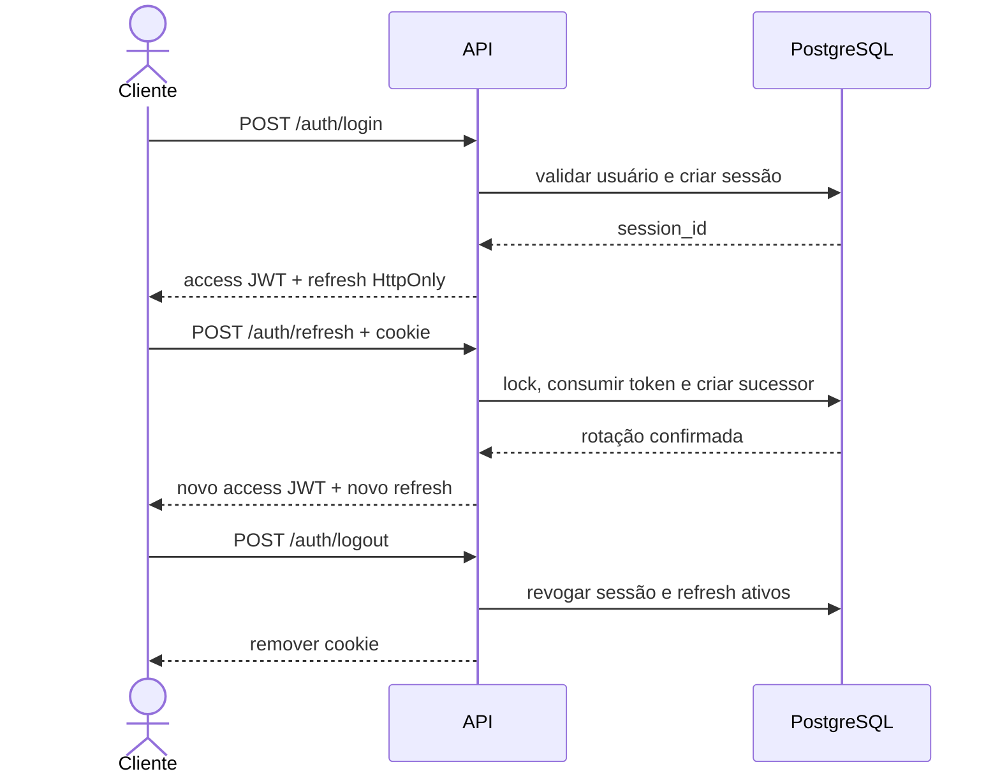

# Autenticação e sessões

Esta entrega implementa a sessão interna do SYNERGIA, access tokens JWT,
refresh tokens opacos de uso único, logout e revogação. A aplicação de RBAC e
escopo organizacional às rotas operacionais pertence à issue seguinte.

## Fronteira de identidade

A identidade corporativa continua sendo o alvo de produção. Como o provedor
ainda não foi homologado, o adaptador local existe somente para desenvolvimento,
teste e homologação, fica desabilitado por padrão e nunca é ativado em
`production`. Recuperação e troca de senha local permanecem bloqueadas pelo
portão `ID-P04` da ADR.

O adaptador local requer simultaneamente:

```text
SYNERGIA_ENV=development|test|homologation
SYNERGIA_LOCAL_AUTH_ENABLED=true
```

Usuários precisam estar `active`, possuir e-mail ativo e um hash Argon2id já
provisionado. A API administrativa não recebe nem retorna senhas.

## Ciclo da sessão



O access token dura 15 minutos. O refresh possui janela ociosa de 8 horas e
limite absoluto de 24 horas. Cada autenticação cria uma sessão; o banco mantém
no máximo três sessões ativas por usuário e revoga a menos recente ao criar a
quarta.

## Contratos

| Método e rota | Credencial | Resultado |
| --- | --- | --- |
| `POST /auth/login` | e-mail e senha; adaptador local restrito | access token e refresh cookie |
| `POST /auth/refresh` | refresh cookie | rotação e novo par |
| `POST /auth/logout` | Bearer access token | revoga a sessão atual |
| `POST /auth/logout-all` | Bearer access token | revoga as sessões do próprio usuário |

Login e refresh são as únicas operações públicas além de `GET /health`; ambas
validam sua própria credencial. Logout exige um access token válido. Revogar
sessões de terceiros dependerá de `session.revoke.any` na camada de autorização.

O JWT exige `iss`, `aud`, `sub`, `sid`, `jti`, `iat`, `nbf`, `exp` e
`typ=access`. Emissor, audiência, chave e algoritmo vêm exclusivamente da
configuração do servidor. O algoritmo aceito neste incremento é `HS256`, sem
negociação pelo conteúdo do token.

O refresh nunca aparece no JSON. Ele usa cookie `HttpOnly`, `SameSite=Strict`,
`Path=/auth` e `Secure` obrigatório em produção. Requisições de navegador com
`Origin` fora de `AUTH_ALLOWED_ORIGINS` são recusadas.

## Rotação, concorrência e replay

O hash SHA-256 do refresh é carregado com lock de linha. O token atual passa a
`used`, recebe `used_at` e aponta para o sucessor. Reutilizar um token usado
revoga a sessão e todos os tokens ainda ativos da família antes de retornar o
erro `refresh_token_reused`.

Duas rotações concorrentes são serializadas. Uma pode receber o sucessor, mas a
detecção de replay pela outra revoga a família inteira; nenhuma falha é exposta
como erro interno.

## Limitação de tentativas

O padrão aceita cinco falhas em uma janela de 15 minutos e aplica bloqueio de
15 minutos. Os limites são configuráveis. E-mail normalizado e endereço IP são
persistidos somente como HMAC-SHA-256. Registros operacionais com mais de 48
horas são removidos durante novas tentativas; os eventos de segurança
append-only permanecem sem credenciais ou tokens.

Usuário inexistente, senha incorreta e estado não ativo retornam o mesmo `401`
e executam uma verificação Argon2id de custo equivalente. Excesso retorna `429`
com `Retry-After`.

## Configuração criptográfica

`AUTH_JWT_SIGNING_KEY` deve vir de segredo externo e possuir pelo menos 32
bytes. Chaves reais não pertencem ao `.env.example`, Git, logs ou evidências.
Ausência de chave, issuer ou audience deixa a autenticação indisponível. Em
produção, `AUTH_REFRESH_COOKIE_SECURE=false` também falha de forma fechada.

O portão `ID-P05` continua exigindo definição corporativa de custódia e rotação
antes de implantação produtiva.

## Validação

```bash
cd backend
ruff check app tests ../scripts
pytest -q tests/test_auth.py
pytest -q -m integration tests/test_auth_persistence.py
```

Os testes usam somente identidades e segredos sintéticos sob `example.invalid`.
