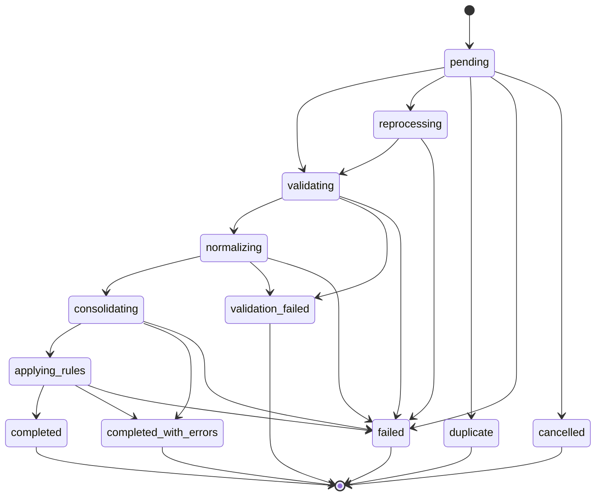

# Ciclo de vida, idempotência e reprocessamento

## Estados oficiais

| Estado | Significado | Terminal |
| --- | --- | --- |
| `pending` | execução criada, ainda sem processamento | não |
| `reprocessing` | nova execução reservada a partir de uma execução anterior | não |
| `validating` | arquivos e registros em validação | não |
| `normalizing` | registros válidos em normalização | não |
| `consolidating` | fontes normalizadas em consolidação | não |
| `applying_rules` | regras versionadas em avaliação | não |
| `validation_failed` | validação bloqueante encerrou a execução | sim |
| `completed` | processamento concluído sem erros | sim |
| `completed_with_errors` | unidades válidas foram confirmadas e erros isolados permaneceram auditáveis | sim |
| `failed` | falha técnica impediu a conclusão | sim |
| `duplicate` | requisição equivalente já havia sido reservada | sim |
| `cancelled` | estado legado preservado para compatibilidade | sim |

Uma execução terminal nunca retorna a um estado intermediário.

## Máquina de estados



As transições são verificadas por `app.execution.validate_transition()` e pela
trigger `executions_validate_transition`. O repositório bloqueia a linha com
`SELECT ... FOR UPDATE`; duas confirmações concorrentes da mesma mudança não
podem ser aceitas.

Cada alteração incrementa `state_version` e grava em
`execution_state_transitions`:

- estado anterior e novo;
- data e hora;
- tipo e identificador do responsável;
- motivo;
- versão otimista da execução.

Os eventos de início, conclusão e falha também são expostos por `audit_events`.

## Idempotência da importação

A reserva idempotente usa um SHA-256 determinístico formado por:

```text
tipo da requisição
+ conjunto ordenado de hashes dos arquivos
+ pipeline_version
+ rule_catalog_version
```

A ordem de envio dos arquivos não altera o fingerprint. A restrição primária de
`execution_idempotency.request_fingerprint` serializa requisições concorrentes:
uma execução reserva o processamento e as demais recebem o identificador da
execução já existente. O mesmo arquivo pode ser processado novamente quando a
versão do pipeline ou das regras muda, sem apagar o resultado anterior.

## Reprocessamento

`POST /executions/{execution_id}/reprocess` aceita:

```json
{
  "technical_origin": "web",
  "idempotency_key": "correlation-123",
  "pipeline_version": "1.0.0",
  "rule_catalog_version": "1.0.0"
}
```

O banco bloqueia a execução raiz durante a criação da nova tentativa. A nova
execução:

- começa em `reprocessing`;
- recebe um novo `execution_id`;
- incrementa `attempt`;
- aponta para a raiz em `reprocessed_from_id`;
- registra as versões solicitadas;
- preserva a execução e os resultados anteriores;
- registra `reprocessing_requested` com a execução imediatamente anterior.

Repetir a mesma origem, chave e versões retorna a mesma execução com
`idempotent_replay=true`. Uma nova chave ou versão cria outra tentativa. Se
qualquer gravação da solicitação falhar, execução, vínculo, reserva idempotente e
evento são revertidos na mesma transação.

Execuções ativas ou estados `duplicate` e `cancelled` não podem ser
reprocessados. Filas, Redis, agendamento e cancelamento distribuído permanecem
fora deste ciclo.
