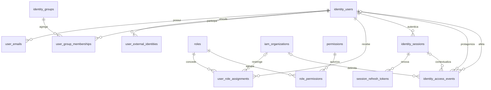

# Modelo persistente de identidade e acesso

Este documento descreve o núcleo criado pelas migrations `0011` a `0013`. A
migration `0016` acrescenta a janela operacional de limitação de login. Os
endpoints de sessão e JWT estão descritos em [autenticação](authentication.md);
adaptador corporativo e telas permanecem fora desta entrega.

As decisões de comportamento estão no
[ADR 0001](adr/0001-identity-strategy.md), e o catálogo de ações está na
[matriz de acesso](access-control-matrix.md).

## Diagrama entidade-relacionamento



## Entidades

### Usuário e formas de identificação

`identity_users` é a raiz interna. Seu UUID é gerado pelo PostgreSQL e não
deriva de e-mail, matrícula, login, claim ou provedor. Os estados permitidos
são `pending`, `active`, `blocked` e `inactive`. Desativação preenche
`deactivated_at`; criação, atualização e último login são preservados.

`user_external_identities` associa `(provider_key, subject_identifier)` a um
usuário. O nome do provedor é uma chave neutra, não uma enumeração de produto,
e atributos adicionais ficam em `jsonb`. Isso permite trocar ou acrescentar um
adaptador sem alterar a identidade interna.

`user_emails` permite vários endereços por usuário e, no máximo, um principal
ativo. `normalized_email = lower(btrim(email))` é uma coluna gerada com
unicidade global. Assim, `Pessoa@Empresa.com` e ` pessoa@empresa.com ` não podem
representar logins distintos. A unicidade global é a decisão inicial; uma
mudança futura para unicidade por organização exigirá nova migration e análise
de compatibilidade.

`local_password_hash` é opcional porque login local continua condicionado à
aprovação. Quando preenchido, aceita somente representação iniciada por
`$argon2id$`. Senha em texto puro não possui coluna no modelo.

### Grupos, papéis e permissões

`identity_groups` representa agrupamentos administrativos ou corporativos sem
acoplar o schema a um diretório. `user_group_memberships` possui UUID próprio e
impede somente uma segunda associação **ativa** para `(user_id, group_id)`.
Após `revoked_at`, uma nova concessão cria outro registro e preserva todos os
ciclos anteriores.

`roles` e `permissions` possuem chaves normalizadas e únicas sem distinção de
caixa. Permissões seguem `recurso.acao`, por exemplo `artifact.export`.
`role_permissions` forma o conjunto de ações de cada papel e rejeita pares
duplicados.

`user_role_assignments` concede um papel global quando `organization_id` é
nulo, ou restrito a uma organização IAM quando preenchido. Índices únicos
parciais impedem duas concessões ativas equivalentes, tanto globais quanto no
mesmo escopo. Após revogação, uma nova concessão recebe outro UUID e o registro
anterior permanece como histórico.

`iam_organizations` é um catálogo estável com UUID. Ele é separado de
`organizations`, que pertence ao modelo operacional legado e registra a
organização observada em uma importação. O mapeamento entre os dois catálogos
será definido junto da aplicação do isolamento por organização; não deve ser
inferido silenciosamente.

### Sessões e refresh tokens

`identity_sessions` mantém uma sessão revogável por autenticação. Uma trigger
bloqueia sessão `active` quando o usuário não está `active`. Ao desativar ou
bloquear um usuário ativo, suas sessões ativas são revogadas com o motivo
`user_status_changed`.

O banco serializa a criação de sessões pelo bloqueio do usuário. Quando já
existem três sessões ativas, a criação da quarta revoga a menos recentemente
utilizada com `concurrent_session_limit`.

`session_refresh_tokens` armazena somente `token_hash`, validado como 64
caracteres hexadecimais, além de família, rotação, expiração e revogação. Não
existe coluna para o segredo original. `replaced_by_token_id` liga a rotação a
outro token da mesma sessão.

`identity_login_attempts` mantém somente HMACs do identificador normalizado e
do IP para aplicar janelas persistentes e concorrentes em ambas as dimensões.
Registros antigos podem ser removidos porque a evidência durável fica em
`identity_access_events`.

### Auditoria

`identity_access_events` registra eventos como `user.created`,
`user.deactivated`, `session.created` e `session.revoked`. As referências não
usam exclusão em cascata. Uma trigger impede `UPDATE` e `DELETE`, tornando a
tabela append-only.

Usuários, vínculos externos, e-mails, organizações IAM, grupos, papéis,
permissões, sessões e refresh tokens também bloqueiam exclusão física. Estado,
`disabled_at`, `deactivated_at`, `revoked_at` ou `expired_at` devem representar
o encerramento lógico.

## Invariantes do banco

- identificadores internos são UUIDs não derivados de atributos pessoais;
- e-mail normalizado é único globalmente, sem distinção de caixa;
- existe no máximo um e-mail principal ativo por usuário;
- senha local, quando autorizada, é somente hash Argon2id;
- `(provider_key, subject_identifier)` identifica um único vínculo externo;
- grupo, papel e permissão não se duplicam por diferença de caixa;
- associações ativas repetidas falham por índice único parcial;
- vínculos revogados podem ser concedidos novamente em outro registro;
- escopos organizacionais referenciam uma organização IAM existente;
- concessão global e concessão por organização são distintas;
- usuário não ativo não recebe nova sessão ativa;
- mudança de ativo para outro estado revoga sessões ativas;
- no máximo três sessões permanecem ativas por usuário;
- refresh token puro não é persistido;
- eventos IAM são imutáveis e não são apagados em cascata;
- dados de identidade usam desativação ou revogação, nunca exclusão física.

## Plano de índices

| Consulta crítica | Índice principal |
| --- | --- |
| Login por e-mail normalizado | `idx_user_emails_login` e unicidade de `normalized_email` |
| Login por provedor e subject | `idx_external_identities_login` |
| Vínculos ativos do usuário | `idx_external_identities_user`, `idx_user_emails_user` |
| Integrantes ativos de grupo | `idx_user_group_memberships_group` |
| Papéis efetivos por usuário/organização | `idx_user_role_assignments_user` |
| Usuários por papel/organização | `idx_user_role_assignments_role` |
| Papéis que possuem uma permissão | `idx_role_permissions_permission` |
| Sessões ativas do usuário | `idx_identity_sessions_user_active` |
| Validação de sessão por ID e expiração | `idx_identity_sessions_validation` |
| Validação de refresh por hash | `idx_refresh_tokens_validation` |
| Rotação/família de refresh | `idx_refresh_tokens_session` |
| Limitação de login por identificador e IP | `idx_identity_login_attempts_window` e `idx_identity_login_attempts_ip_window` |
| Auditoria por usuário, entidade ou sessão | `idx_identity_events_subject`, `idx_identity_events_entity`, `idx_identity_events_session` |

Índices parciais excluem registros inativos das consultas frequentes. As
restrições `UNIQUE` também criam índices para e-mail, chaves normalizadas,
vínculos externos e associações.

## Migrations e rollback

| Migration | Responsabilidade | Rollback explícito |
| --- | --- | --- |
| `0011_create_identity_users.sql` | usuários, identidades externas e e-mails | `database/rollbacks/0011_create_identity_users.down.sql` |
| `0012_create_authorization_model.sql` | organizações IAM, grupos, papéis e permissões | `database/rollbacks/0012_create_authorization_model.down.sql` |
| `0013_create_identity_sessions.sql` | sessões, refresh tokens, eventos e triggers | `database/rollbacks/0013_create_identity_sessions.down.sql` |
| `0016_create_authentication_attempts.sql` | janela de limitação de login | `database/rollbacks/0016_create_authentication_attempts.down.sql` |

Rollback é uma operação deliberada e destrutiva, permitida apenas antes de
existirem dados reais ou com plano aprovado. A ordem é `0013`, `0012`, `0011`.
Migrations já publicadas não devem ser alteradas; correções usam novo número.

## Validação

Partindo de PostgreSQL vazio, aplique todas as migrations conforme
[database/README.md](../database/README.md) e execute:

```bash
cd backend
pytest -q -m integration tests/test_identity_persistence.py
```

Os testes exercitam casos positivos e negativos de e-mail, chaves
case-insensitive, associações, auditoria, sessão, escopo, refresh token e
índices. Todos os dados usados são sintéticos.
