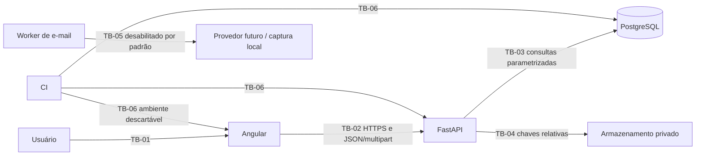

# Modelo de ameaças e baseline de riscos

## Estado e finalidade

Este documento representa a arquitetura entregue até a Etapa 4 e é a baseline
de segurança da Etapa 5. Ele orienta as issues #90 a #96 sem declarar como
prontos controles que ainda dependem de implementação ou decisão corporativa.
O registro canônico e validável está em
[`security-risk-register.json`](security-risk-register.json).

O escopo cobre Angular, FastAPI, PostgreSQL, armazenamento controlado, worker de
e-mail e CI. Conectores automáticos, RPA, identidade corporativa, SMTP
corporativo e infraestrutura definitiva não são componentes disponíveis.

## Método de classificação

Probabilidade:

- `unlikely`: exige condições incomuns, acesso privilegiado ou várias falhas;
- `possible`: é tecnicamente plausível nas condições esperadas;
- `likely`: pode ser tentado com frequência ou por entradas comuns.

Impacto:

- `low`: efeito local, reversível e sem dado sensível;
- `medium`: degradação limitada ou exposição interna de baixo alcance;
- `high`: perda relevante de confidencialidade, integridade ou disponibilidade;
- `critical`: comprometimento de identidade, isolamento, decisão ou recuperação.

A severidade inerente registra o risco antes dos controles. A severidade
residual considera apenas controles implementados e com evidência. A decisão é:

| Probabilidade / impacto | baixo | médio | alto | crítico |
| --- | --- | --- | --- | --- |
| improvável | baixo | baixo | médio | alto |
| possível | baixo | médio | alto | crítico |
| provável | baixo | alto | alto | crítico |

- `mitigated`: controles atuais reduzem o risco e possuem teste;
- `accepted`: o risco residual foi aceito com justificativa explícita;
- `blocked`: impede a release candidate até a issue indicada;
- `transferred`: depende de etapa ou autoridade externa, com condição de
  retomada registrada.

Risco inerente alto ou crítico sempre exige controle e evidência atuais ou uma
decisão formal de bloqueio/transferência. Aceites e exceções não são implícitos.

## Ativos e dados

| Grupo | Ativos | Sensibilidade e requisito |
| --- | --- | --- |
| Identidade | credencial, usuário, e-mail, vínculo externo | alta; não enumerar ou registrar segredo |
| Sessão | access token, hash de refresh, família, revogação | crítica; curta duração, rotação e revogação |
| Autorização | papéis, grupos, permissões, organização | crítica; negação padrão e auditoria |
| Entrada | arquivo, hash, quarentena, fonte e proveniência | alta; conteúdo não confiável e armazenamento privado |
| Operação | execução, Workorder, lote, serial e pendência | alta; isolamento por organização e integridade |
| Relatório | snapshot, versão, filtros e exportação | alta; imutabilidade e neutralização de conteúdo |
| Notificação | destinatário, preferência, template e entrega | alta; acesso próprio e minimização |
| Decisão | política, atribuição, justificativa e consentimento | crítica; segregação, autoria e histórico imutável |
| Evidência | auditoria, logs, métricas e artefatos de CI | alta; integridade, retenção e ausência de segredos |

Identificadores operacionais não são segredos, mas podem revelar existência,
volume ou relacionamento. Por isso continuam sujeitos a autorização e escopo.

## Atores e níveis de confiança

| Ator | Confiança | Limite |
| --- | --- | --- |
| usuário anônimo | não confiável | login, refresh e recursos estritamente públicos |
| usuário autenticado | parcialmente confiável | somente permissões e organizações efetivas |
| admin | privilegiado em identidade | não recebe operação de negócio implicitamente |
| gestor | privilegiado na operação | sujeito a organização, política e segregação |
| analista, operador e consulta | limitado por ação | não podem ampliar o próprio escopo |
| navegador Angular | não confiável para decisão | validação visual nunca substitui o backend |
| FastAPI | fronteira de aplicação | autentica, autoriza, valida e minimiza respostas |
| PostgreSQL | fonte de verdade | acesso exclusivo pelos serviços autorizados |
| armazenamento controlado | privado | usa chaves relativas e nomes físicos aleatórios |
| worker de e-mail | serviço restrito | sem papel humano ou acesso interativo |
| provedor externo futuro | não confiável até homologação | desabilitado; somente captura local está disponível |
| runner de CI | efêmero | dados sintéticos e credenciais descartáveis |

## Fronteiras de confiança

`TB-01` e `TB-02` recebem conteúdo não confiável. O navegador pode ser
modificado pelo usuário; guards, campos ocultos e menus não concedem segurança.
`TB-03` e `TB-04` só podem ser atravessadas pelo backend. `TB-05` permanece
fechada em produção enquanto custódia de segredos, destinatários e operação não
forem homologados. `TB-06` não utiliza dados nem credenciais corporativas.

## Jornadas críticas

| Jornada | Atores | Ativos principais | Fronteiras | Ameaças dominantes |
| --- | --- | --- | --- | --- |
| J-01 autenticação e sessão | anônimo, autenticado | credenciais, tokens, sessão | TB-01, TB-02, TB-03 | spoofing, replay, CSRF, enumeração e abuso |
| J-02 upload e ingestão | gestor, operador | arquivo, quarentena, execução | TB-01 a TB-04 | arquivo malicioso, traversal e exaustão |
| J-03 consulta e reprocessamento | papéis operacionais | entidades e histórico | TB-01 a TB-03 | IDOR/BOLA, injeção, enumeração e duplicidade |
| J-04 relatório e exportação | gestor, analista, consulta | snapshot, versão, CSV/JSON | TB-01 a TB-03 | vazamento, fórmula, XSS, sobrescrita e abuso |
| J-05 notificação e e-mail | destinatário, worker | preferência, mensagem, entrega | TB-01, TB-02, TB-03, TB-05 | destinatário incorreto, duplicidade e segredo |
| J-06 aprovação humana | solicitante, gestor, auditor | política, justificativa, decisão | TB-01 a TB-03 | elevação, quebra de segregação e repúdio |
| J-07 administração de identidade | admin, usuário alvo | ciclo de vida, papel e escopo | TB-01 a TB-03 | mass assignment e elevação vertical |

Os métodos, caminhos, permissões e escopos mínimos dessas jornadas são
conferidos automaticamente contra OpenAPI e `access-control-matrix.md`. O gate
também impede a remoção silenciosa de uma operação mínima ou classe de ameaça
obrigatória. O frontend não é considerado fonte de autorização.

### Aplicabilidade de SSRF

SSRF foi analisado e é **não aplicável à superfície atual**: o FastAPI não busca
URLs fornecidas pelo usuário e não existe contrato de webhook, importação remota
ou conector de saída. A decisão deve ser reaberta na Etapa 6, antes da inclusão
de conectores RPA, webhooks ou qualquer recuperação de URL no servidor.

## Registro de riscos

| ID | Jornada | Risco resumido | Inerente | Residual | Decisão | Responsável | Tratamento |
| --- | --- | --- | --- | --- | --- | --- | --- |
| R-01 | J-01 | stuffing e enumeração de identidade | alto | médio | mitigado | security | #91 |
| R-02 | J-01 | replay de token ou refresh | crítico | médio | mitigado | identity | #92 |
| R-03 | J-01 | identidade corporativa não homologada; login local restrito a ambientes não produtivos | crítico | alto | bloqueado | platform | #96 |
| R-04 | J-02 | conteúdo ativo ou arquivo disfarçado | alto | médio | mitigado | backend | #92 |
| R-05 | J-02 | fuga do armazenamento controlado | alto | baixo | mitigado | backend | #92 |
| R-06 | J-02 | exaustão por uploads | alto | médio | mitigado | security | #91 |
| R-07 | J-03 | acesso fora da organização | crítico | médio | mitigado | authorization | #92 |
| R-08 | J-03 | injeção em busca ou filtro | crítico | baixo | mitigado | backend | #92 |
| R-09 | J-03 | consulta ou reprocessamento abusivo | alto | médio | mitigado | security | #91 |
| R-10 | J-04 | vazamento de snapshot ou exportação | crítico | médio | mitigado | reports | #92 |
| R-11 | J-04 | fórmula executável ou histórico alterado | alto | baixo | mitigado | reports | #92 |
| R-12 | J-04 | geração ou exportação excessiva | alto | alto | bloqueado | performance | #95 |
| R-13 | J-05 | notificação entregue a outro destinatário | alto | baixo | mitigado | notifications | #92 |
| R-14 | J-05 | entrega duplicada ou worker obsoleto | alto | médio | mitigado | notifications | #95 |
| R-15 | J-05 | segredo ou mensagem no provedor corporativo | crítico | alto | transferido | platform | #96 / Etapa 8 |
| R-16 | J-06 | autoaprovação ou decisor inelegível | crítico | médio | mitigado | approvals | #92 |
| R-17 | J-06 | concorrência, política ou histórico adulterado | crítico | baixo | mitigado | approvals | #92 |
| R-18 | J-06 | decisão sem autoria ou consentimento | alto | baixo | mitigado | approvals | #92 |
| R-19 | J-07 | concessão administrativa indevida | crítico | médio | mitigado | identity | #92 |
| R-20 | J-07 | auditoria indisponível ou irrecuperável | crítico | alto | bloqueado | operations | #94 |
| R-21 | J-03 | segredo em log, erro, métrica ou artefato | alto | baixo | mitigado | observability | #93 |
| R-22 | J-03 | degradação não detectada ou sem recuperação | crítico | alto | bloqueado | operations | #94 |
| R-23 | J-02 | dependência, segredo ou build comprometido | crítico | médio | mitigado | security | #92 |
| R-24 | J-06 | política inicial confundida com alçada final | alto | médio | transferido | product | #96 / Etapa 8 |
| R-25 | J-01 | CORS, cache ou política do navegador permissiva | crítico | alto | bloqueado | security | #90 |
| R-26 | J-04 | conteúdo operacional executado como XSS | crítico | alto | bloqueado | security | #90 |
| R-27 | J-01 | ação de sessão induzida por CSRF | alto | médio | mitigado | security | #90 |

Detalhes de ameaça, controles e evidências são mantidos no registro JSON. Um
controle só reduz a severidade residual quando sua evidência existe no
repositório. Riscos bloqueados não são aceites tácitos: eles impedem o marco da
Issue #96 até o tratamento indicado.

## Distribuição para a Etapa 5

| Issue | Responsabilidade derivada do risco |
| --- | --- |
| #90 | headers, CORS, CSP, cache e conteúdo no navegador |
| #91 | limites de login, upload, busca, reprocessamento e relatório |
| #92 | regressão ofensiva, DAST, dependências, segredos e SBOM |
| #93 | logs, métricas, health, readiness, dashboards e alertas |
| #94 | retenção, backup, restauração e runbooks |
| #95 | volume, concorrência, idempotência e recuperação |
| #96 | reteste integral, riscos residuais e decisão de release candidate |

## Portões e riscos transferidos

- R-03 bloqueia produção enquanto o adaptador local não estiver proibido pela
  configuração e a identidade corporativa não estiver homologada.
- R-15 retorna antes de habilitar qualquer provedor corporativo de e-mail. A
  retomada exige custódia de segredo, política de destinatário e monitoramento.
- R-24 retorna antes do uso produtivo das aprovações. O negócio deve homologar
  grupo revisor, alçadas, segregação, justificativa e consentimento.
- Celery, Redis e conectores RPA serão modelados na Etapa 6, quando existirem
  contratos e desenho implementável; não são superfícies ativas deste modelo.

## Registro de revisão

| Papel | Evidência esperada | Estado |
| --- | --- | --- |
| responsável técnico | revisão do PR da Issue #89 | pendente |
| segurança ou PO | aceite da classificação e dos portões | pendente |

O merge exige que essas revisões fiquem registradas no PR. Alterações futuras
em jornada, fronteira, permissão, dado sensível ou componente devem atualizar o
registro e executar `python scripts/validate_threat_model.py`.
