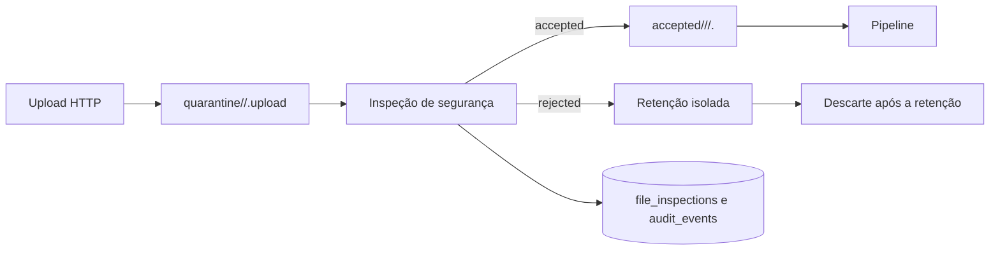

# Recebimento seguro e quarentena de arquivos

Todo conteúdo enviado a `POST /imports` é não confiável. O backend grava os
bytes com um nome aleatório em uma área de quarentena, calcula o SHA-256 durante
a leitura e executa a inspeção antes de chamar qualquer leitor do pipeline.
Somente uma decisão `accepted` permite a movimentação para a área aceita.

## Fluxo



O nome original é metadado auditável, nunca um componente do caminho. O token
interno possui 192 bits gerados por fonte criptograficamente segura. Caminhos
absolutos, segmentos `..`, barras Unix/Windows, nomes com drive, NUL e variantes
com percent-encoding são rejeitados.

## Formatos e limites

| Fonte | Formatos padrão | MIME aceitos | Limite padrão |
| --- | --- | --- | --- |
| N-FP | CSV, JSON, XLSX | `text/csv`, `application/json`, MIME OpenXML | 25 MiB |
| OWM | CSV, JSON, XLSX | `text/csv`, `application/json`, MIME OpenXML | 25 MiB |
| GMES/OQC | CSV, JSON, XLSX | `text/csv`, `application/json`, MIME OpenXML | 25 MiB |
| TMS | CSV, JSON, XLSX | `text/csv`, `application/json`, MIME OpenXML | 25 MiB |

`application/octet-stream` é tratado como MIME não declarado: ele não determina
o tipo, que continua sendo identificado pelo conteúdo. Um MIME específico
incompatível é rejeitado.

As políticas podem ser restringidas sem alterar código:

```text
UPLOAD_ALLOWED_EXTENSIONS=csv,json,xlsx
UPLOAD_ALLOWED_EXTENSIONS_N_FP=csv,xlsx
UPLOAD_MAX_BYTES=26214400
UPLOAD_MAX_BYTES_N_FP=10485760
UPLOAD_MAX_ARCHIVE_ENTRIES=2000
UPLOAD_MAX_ARCHIVE_UNCOMPRESSED_BYTES=104857600
UPLOAD_MAX_COMPRESSION_RATIO=100
UPLOAD_REJECTED_RETENTION_HOURS=24
```

O sufixo da fonte é normalizado em maiúsculas e `_`; por exemplo, `GMES/OQC`
usa `GMES_OQC`.

A configuração aceita somente extensões para as quais exista um inspetor de
conteúdo (`csv`, `json` e `xlsx`). Valores desconhecidos tornam a política
inválida e bloqueiam o upload, evitando anunciar um formato que seria rejeitado
pelo servidor.

A aplicação web consulta `GET /imports/policy` antes de habilitar o formulário.
O contrato retorna `allowed_extensions` e `max_bytes` por fonte, calculados pela
mesma configuração usada na inspeção. Assim, orientações e validações locais
acompanham a política ativa sem se tornarem uma segunda fonte de verdade. O
endpoint exige `import.create`.

## Inspeções aplicadas

- extensão permitida pela política da fonte;
- MIME declarado compatível;
- detecção de JSON, CSV, HTML/JavaScript disfarçado e ZIP OpenXML;
- magic bytes `PK\x03\x04` e estrutura mínima de XLSX;
- integridade CRC do ZIP, quantidade de entradas, tamanho descompactado e razão
  de compressão;
- caminhos internos inseguros e arquivos compactados criptografados;
- VBA, macro sheets, ActiveX e custom UI;
- objetos OLE/incorporados;
- vínculos, relacionamentos e conexões externas;
- fórmulas com `CALL`, DDE, `EXEC`, `HYPERLINK`, `REGISTER.ID`, `RTD` ou
  `WEBSERVICE`, além de padrões de injeção em texto;
- arquivo vazio, truncado, corrompido, binário incompatível ou desconhecido.

O controle de ZIP ocorre com base no diretório central antes da descompressão
completa. A leitura integral só ocorre depois de limites de entradas, tamanho e
razão terem sido aprovados.

## Auditoria sem exposição de caminho

`GET /imports/{execution_id}/inspections` retorna as decisões da execução. O
contrato não inclui nome interno, chave de storage ou caminho absoluto:

```json
{
  "inspection_id": 41,
  "source": "N-FP",
  "original_file_name": "relatorio.csv",
  "extension": "csv",
  "declared_media_type": "text/csv",
  "detected_media_type": "text/html",
  "size_bytes": 37,
  "sha256": "b271...c801",
  "decision": "rejected",
  "reason_code": "disguised_active_content",
  "analyzed_at": "2026-08-30T18:00:00Z",
  "retained_until": "2026-08-31T18:00:00Z",
  "discarded_at": null
}
```

A mesma decisão gera `file_accepted` ou `file_rejected` em `audit_events`. O
evento contém hash, tamanho, tipos, decisão, motivo e datas, mas não contém
caminhos nem o nome interno.

## Retenção e descarte

Rejeitados abaixo do limite permanecem exclusivamente em `quarantine/` pelo
prazo configurado, 24 horas por padrão. Nenhum endpoint de arquivo serve essa
área. Uma nova recepção elimina itens expirados e marca `discarded_at` no
registro correspondente. Arquivos acima do limite e retenção configurada como
zero são descartados imediatamente; seus metadados e motivo permanecem no
banco. Aceitos saem da quarentena e ficam em `accepted/`.

Essa limpeza oportunista é a garantia disponível nesta etapa. Agendamento
distribuído, antivírus corporativo, armazenamento em nuvem, autenticação,
autorização e RPA permanecem fora do escopo.
